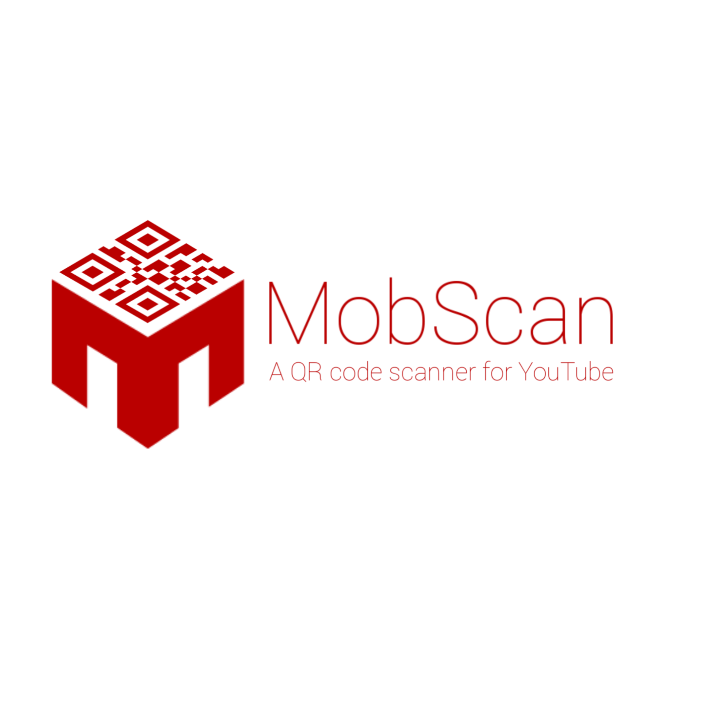
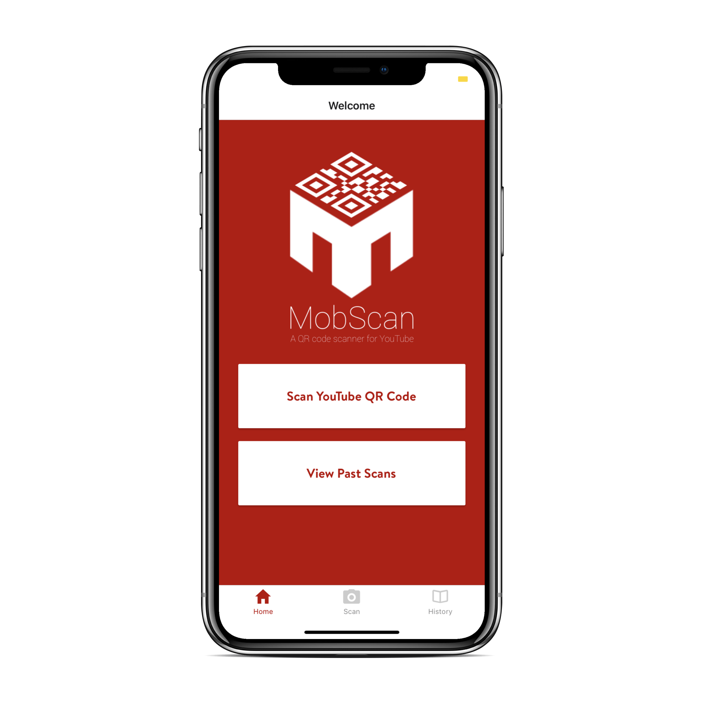
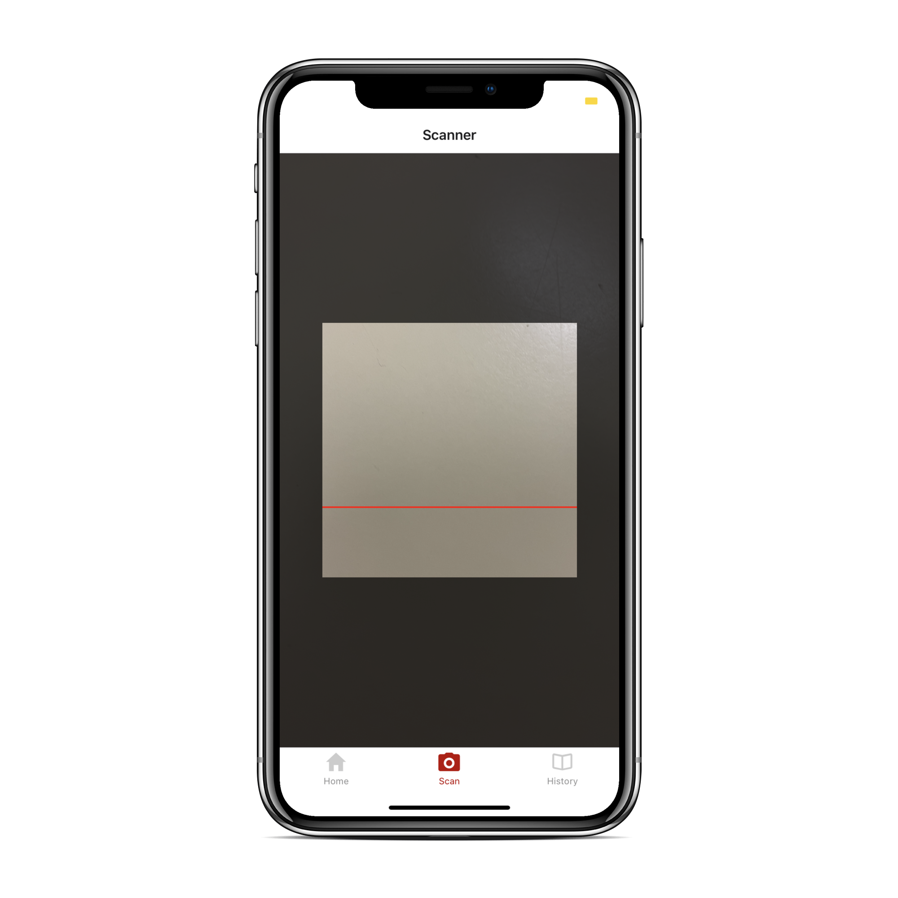
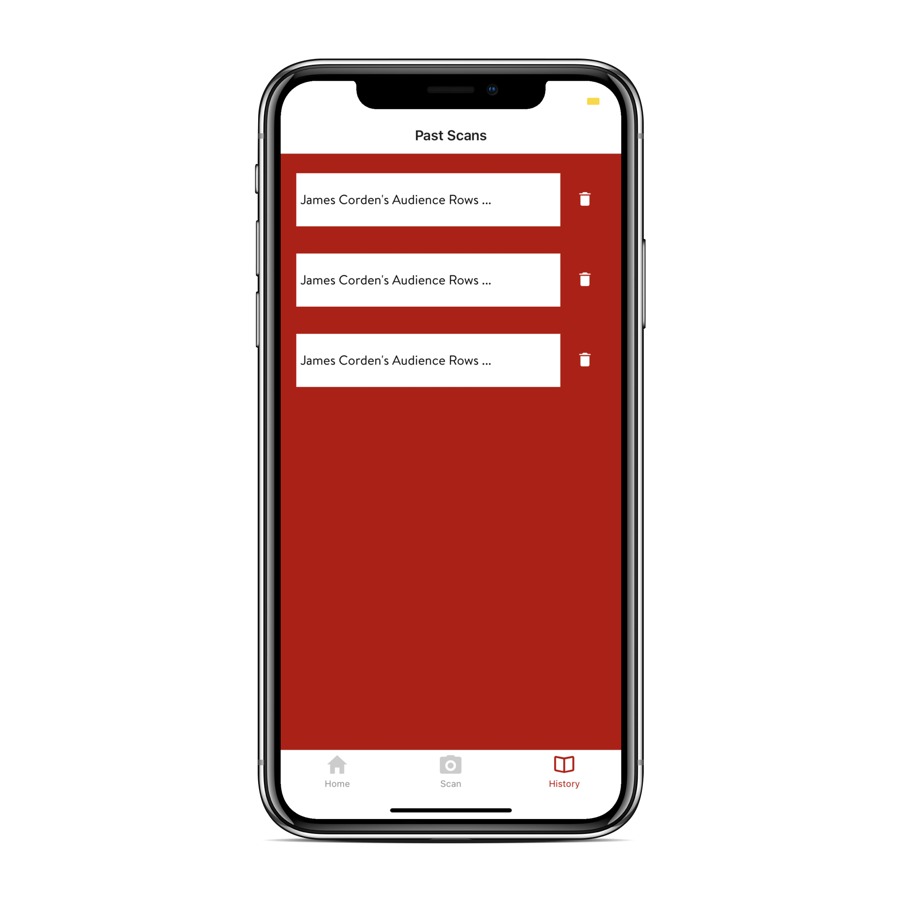
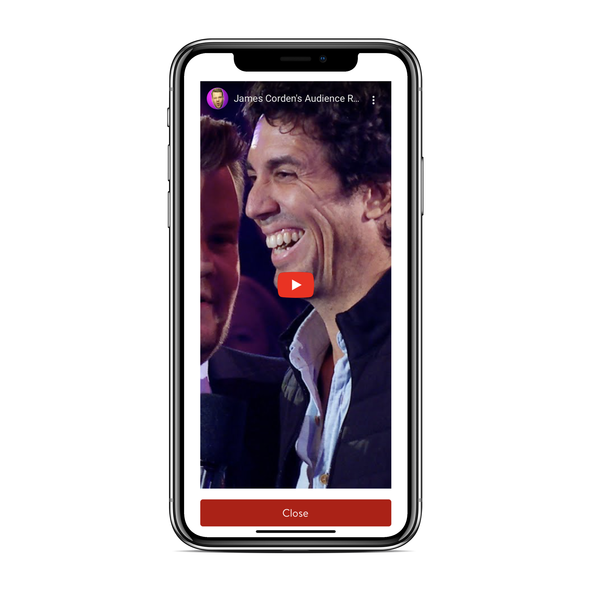

MobLab Interview
=============

Your task will be to write a mobile-friendly React based ([https://reactjs.org/](https://reactjs.org/)) YouTube QR code scanner.

---
These are the requirements:

* Build a basic landing page that has a header and a button to launch the scanner (launch the device's camera).
* The QR code scanner must recognize YouTube links and display the video embedded in the app.
* Build a history page that allows you to access any previously scanned codes (valid only).
	* This is intended to be open-ended: it is entirely up to you what this page will entail.
	* The only requirement: tapping on a history item should re-display the embedded video (rather than opening the link)

---
**Setup**
`npm install` to install all required packages, then proceed to type `npm start` to run Expo. 
Your default web browser will open with a locally hosted Expo page. There you will find a QR code
which you can scan with an iOS or Android device which has the Expo app installed. Expo will then
proceed to build your app then download and install it on your device. If you have network issues,
consider switching to the `tunnel` tab within the Expo web page.

---
**Features**
- Scanner for QR codes with YouTube links embedded
- Alerts users if QR code is not a valid YouTube link
- Allows users to keep track of past scans
- Users can delete scans from history
- Data persists after restarting the app
- Users may view video directly within the app
- Redesign of MobLab logo that incorporates QR element
---
**Screens**

